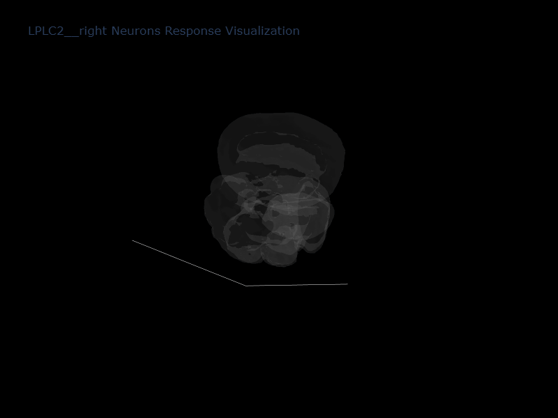

# VFP
Mapping Visual Function Profiles of Individual Neurons Across the Drosophila Brain

# Drosophila Visual Functional Profiling (VFP) Pipeline

This repository contains scripts and instructions for generating the **Drosophila connectome weight matrix** and computing **Visual Functional Profiles (VFP)** for specific neuron types.

---

## 1. Generate Connectome Weight Matrix

This step constructs the synaptic weight matrix used for visual functional profiling.

### Output Files

After execution, the output directory will contain:

- **weight_matrix.npz** — Sparse matrix in SciPy CSR format  
- **neuron_ids.npy** — List of neuron root IDs  
- **weight_matrix.txt** — Text format: `pre_neuron_id post_neuron_id weight_value`

### Parameters

| Parameter | Description | Value |
|-----------|-------------|-------|
| `connections_path` | Path to connection data | `"data/connections.txt"` |
| `synapses_path` | Path to input synapses | `"data/synapses.txt"` |
| `target_pos_sum` | Positive sum for each postsynaptic neuron | `1` |
| `target_neg_sum` | Negative sum for each postsynaptic neuron | `-1` |
| `n_jobs` | Number of parallel threads | `20` |
| `results_dir` | Output directory | `"output"` |

### Purpose

The weight matrix encodes excitatory and inhibitory connectivity between neurons and serves as input for downstream VFP analyses.

---

## 2. Compute Visual Functional Profile (VFP)

This step analyzes the connectome weight matrix to generate visual functional profiles for neurons.

### Input Files

- **matrix_npz_path** — Path to the sparse weight matrix (`weight_matrix.npz`)  
- **neuron_ids_path** — Path to neuron IDs list (`neuron_ids.npy`)  
- **neuron_types_path** — CSV mapping neuron IDs to types (`visual_neuron_types.txt`)  

> **Note:** The `matrices` folder required for this step can be obtained in **two ways**:
> 1. Download precomputed matrices from [Zenodo](https://zenodo.org/).  
> 2. Generate them by running `VisualFunctionProfile.ipynb` in this repository.

### Parameters

| Parameter | Description | Example Value |
|-----------|-------------|---------------|
| `neuron_types` | Set of neuron types to analyze | `{'L1','L2','L3'}` |
| `side` | Hemisphere to analyze (`left` or `right`) | `'right'` |
| `max_depth` | Maximum recursion depth for connectivity analysis | `100` |
| `min_weight` | Minimum synaptic weight threshold for inclusion | `1e-8` |
| `num_processes` | Number of parallel processes | `20` |
| `blocked_types` | List of neuron types to exclude | `[]` |

### Purpose

The VFP analyzer computes neuron-specific functional profiles considering excitatory and inhibitory weights. The results can be used for downstream visualization, heatmap generation, and analysis of motion-related neuron responses.

---
